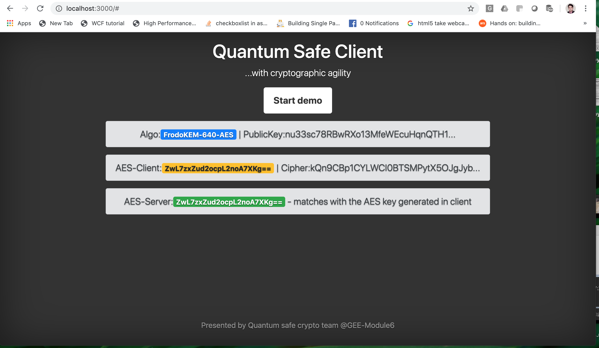

# liboqs-javascript

### This works in linux and mac, not in windows

This is a javascript wrapper (works in browser) on [liboqs C library](https://github.com/open-quantum-safe/liboqs).

## How to run demo (HTML client with NodeJs/Express server)

```
clone this repo into your local
cd <cloned repo>
npm install
npm run demo
```


## How to test

```
clone this repo into your local
cd <cloned repo>
npm install
npm test
```

## How to build (optional)

Download and setup [emscripten](https://emscripten.org/docs/getting_started/downloads.html#installation-instructions). We shall use emcc to build this repo.
C files (source) can be found under javascript/source folder, emcc will generate new js/wasm files under javascript folder.

```
clone this repo into your local
cd <cloned repo>
npm install

//build client javascript
npm run build-client

//build server javascript
npm run build-server
```
